<p align="center">
  
</p>

# E-ink Studio — Home Assistant Add-on

A **visual editor for ESPHome e-paper displays**, running as a Home Assistant
add-on with its own sidebar panel (Ingress). Drag elements onto a paper-accurate
canvas, bind them to **live Home Assistant sensor values**, and generate
ready-to-paste ESPHome `display:` lambda + YAML — no more hand-counting pixels.

[](https://github.com/Cl3tus/HA-Eink-Studio-App)
[](https://github.com/Cl3tus/HA-Eink-Studio-App)
[](https://github.com/Cl3tus/HA-Eink-Studio-App/commits/main)
[](LICENSE)


[](https://my.home-assistant.io/redirect/supervisor_add_addon_repository/?repository_url=https%3A%2F%2Fgithub.com%2FCl3tus%2FHA-Eink-Studio-App)

---

<p align="center">
  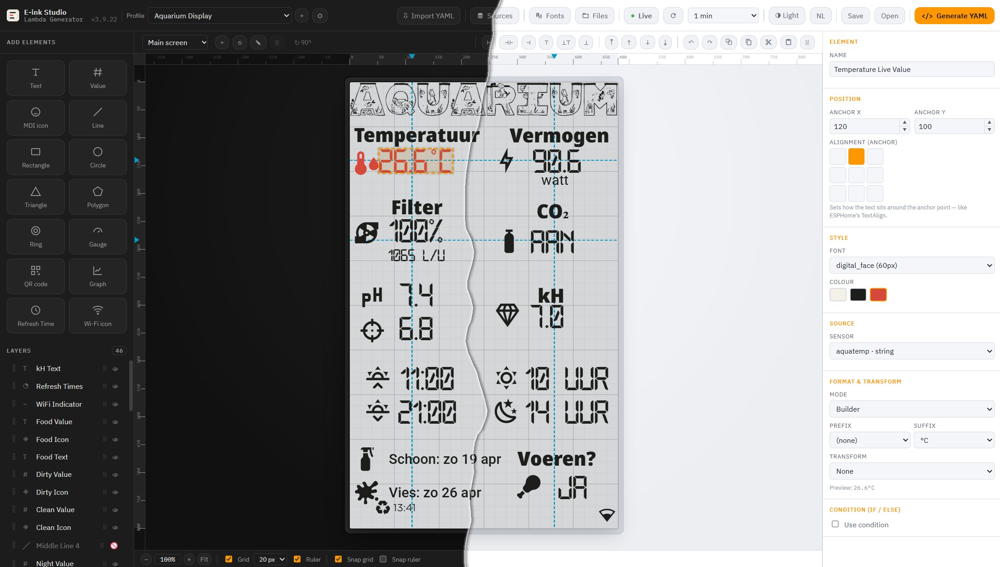
</p>

## ✨ Why

Hand-writing ESPHome `it.print()` / `it.printf()` lambdas for an e-paper display
is tedious: you count pixels, guess alignment, juggle fonts and glyph lists, and
re-flash to see the result. E-ink Studio turns that into a **visual design task** —
you see exactly what the panel will show, bind values to your real entities, and
copy the generated YAML straight into your device.

## 🎨 Features

**Design**
- Drag-and-drop canvas with a **paper-accurate**, **pixel-accurate** preview — text
  and icons sit on the real font baseline, exactly like ESPHome's `TextAlign`.
- Elements: **Text**, **Value** (sensor + format/transform), **MDI icon**, **line**,
  **rectangle**, **circle / oval**, **triangle**, **polygon**, **ring**, **gauge**,
  **QR code**, **graph** (with legend), **refresh clock**, **Wi-Fi signal icon**.
- **Rotate, resize, fill** shapes with on-canvas handles; **align** the whole
  selection (left/center/right/top/middle/bottom) and reorder with **layer-order**
  buttons (front / back / forward / backward).
- **Grid + snap** (8 / 10 / 16 / 20 / 25 / 40 px), plus **Figma-style rulers & guide
  lines** with **pixel-perfect snapping** to the visible ink — snap into the cross of
  a vertical and a horizontal guide at once. Hold **Shift** to move freely.
- Sticky **status bar** with editable zoom (up to 500 %), grid, ruler and snap toggles.
- **Multi-select** (rubber-band, Ctrl/Shift-click, layer checkboxes), **layers**
  panel with drag-to-reorder, visibility toggle, rename and delete.
- **Undo/redo**, **duplicate**, and **cut / copy / paste** (Ctrl+X / C / V) — paste
  even works **between the main and waiting screen**.
- **Multiple screens** (up to 10) per design, **switchable from Home Assistant** via a
  generated `select`, per-screen `button`s and an optional rotation `switch` — plus a
  separate **waiting-for-data** screen.
- **Negative mode** (per profile): a black screen with white content (`it.fill` + swapped
  base colours).
- **Conditions (if/else)** on any element — show/hide or recolour per branch.

**Data & values**
- Pick real **Home Assistant entities** from a searchable list and bind them to
  value elements, with **type detection** (number / bool / time / string) that flags a
  mismatch between your lambda type and what HA reports — one click to snap it.
- **Live preview** of the actual sensor states while you design (read-only), with a
  refresh button and an auto-refresh interval (off / 1–30 min / custom).
- **Transforms**: round/scale numbers, on/off → custom labels, time → `HH:MM`,
  dates in many formats, weekday/month **names** (NL & EN), and a **custom
  date/time format** with tokens like `{wd} {dd} {mon}` → `Sun 19 Jun`.
- **Prefix/suffix** with an automatic space before units (`1065` → `1065 L/h`).

**Fonts & colours**
- Manage **Google Fonts** and **local TTF/OTF** (upload + dedupe + live preview), with a
  named **weight** dropdown (Thin 100 … Black 900) and an **Italic** toggle — bundled
  variable fonts so every weight previews distinctly.
- **Material Design Icons** (v7.4.47) bundled and seeded into your `fonts/` folder.
- **Download Fonts (.zip)** — grab your whole `fonts/` folder as one archive and
  unpack it into ESPHome's `config/fonts/` (the add-on never writes there itself).
- Colours follow the display's colour type automatically (mono / B-W-R / 7-colour).

**YAML output**
- One click produces the ESPHome **lambda + matching blocks**.
- **Per-block toggles** (Profile settings → *Generated YAML Blocks*): refresh logic
  (`esphome` on_boot + `script` + `time`), the **HA screen control** (dropdown / buttons
  / both / none) and **screen rotation switch**, `globals`, `font`, `color`, `sensor`,
  `text_sensor`, the `spi` bus, and the **display pins** (each pin individually).
- A compact **base64 recovery comment** lets you paste the YAML back later to
  restore the whole editable design.

**Import**
- Paste a complete ESPHome config — only `font:`, `color:` and `homeassistant`
  `sensor:`/`text_sensor:` are read, the rest is ignored.
- The studio also **reverse-engineers the `display:` lambda** back into editable
  elements (best-effort) and shows a summary of what was/wasn't imported.

**Files & the rest**
- Built-in **file manager**: collapsible tree, multi-select, text editor
  (undo/redo), font preview, upload/download/rename/move/delete — also reachable
  over **SAMBA**.
- **Profiles** to keep multiple designs side by side, with **duplicate** and a
  **model picker** that pre-fills width/height for known panels.
- **Light / dark** theme and **English / Dutch** — automatically following Home
  Assistant, or fixed in the add-on options.
- **Fully offline** — Konva, js-yaml, MDI and all fonts are bundled.

---

## 📸 Screenshots

**Editor — dark & light**

<p align="center">
  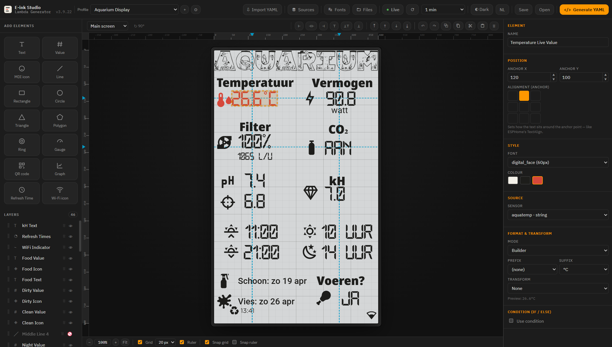
  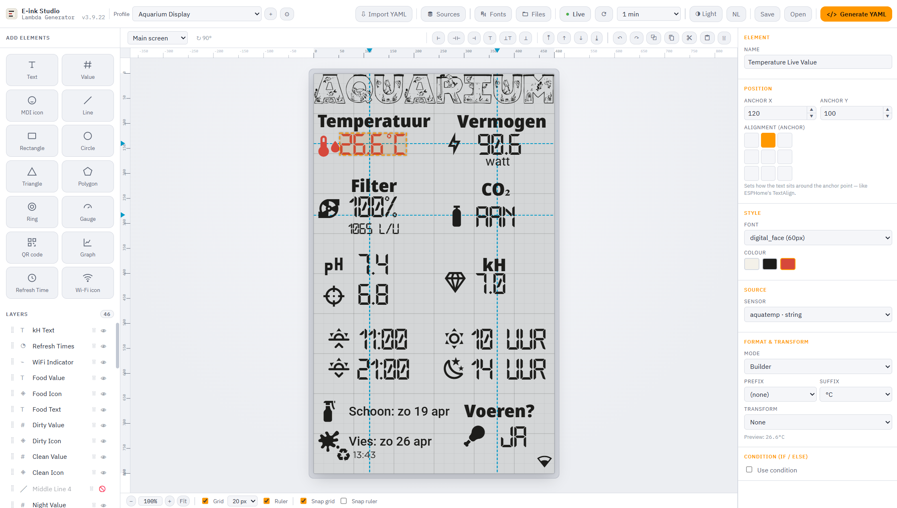
</p>

**Built-in file manager**

<p align="center">
  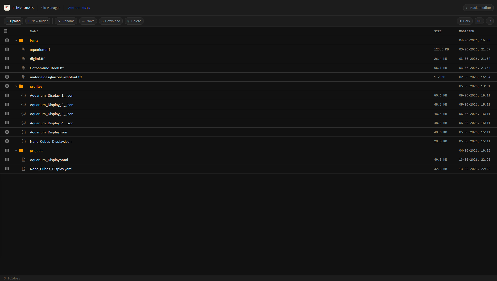
</p>

<p align="center">
  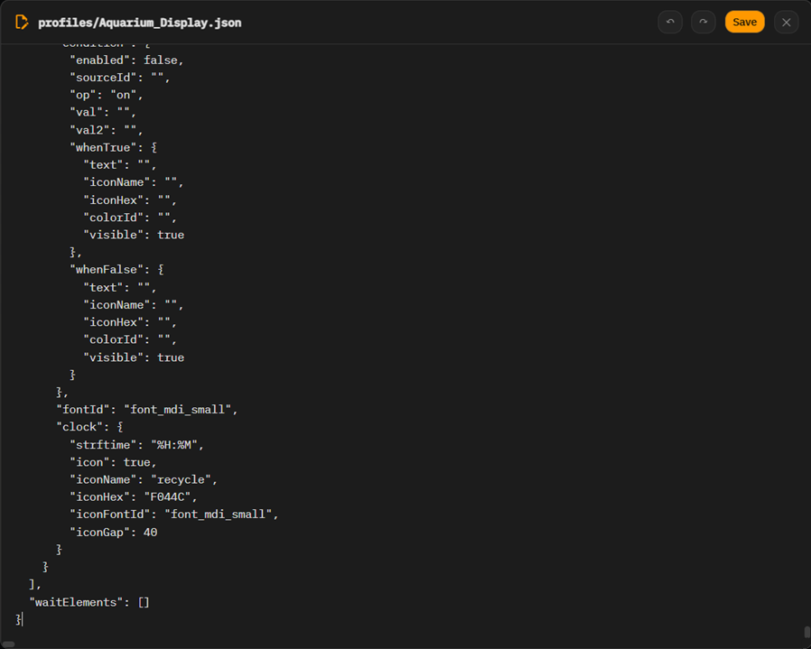
  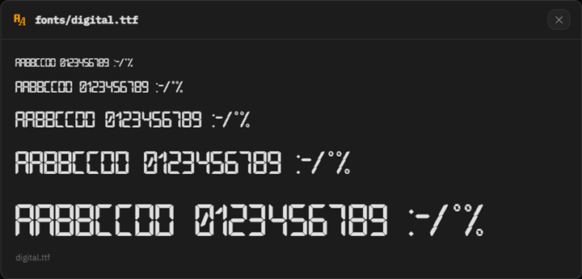
</p>

**Inspector — a Value element** (source + format & transform), **Element palette & layers**

<p align="center">
  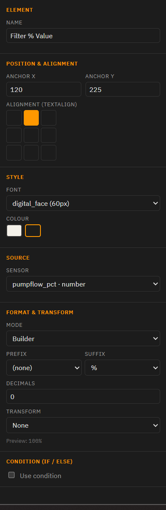
  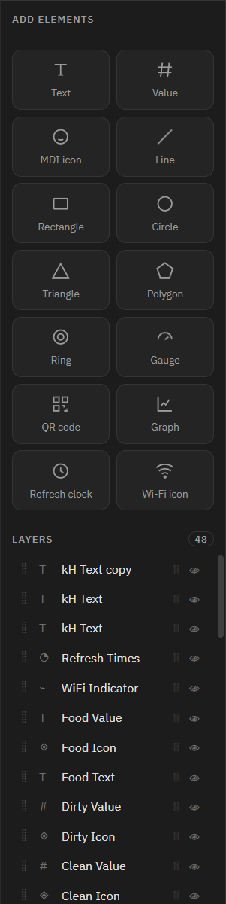
</p>

**Profile settings — per-block YAML toggles** &nbsp;·&nbsp; **Value sources picker**

<p align="center">
  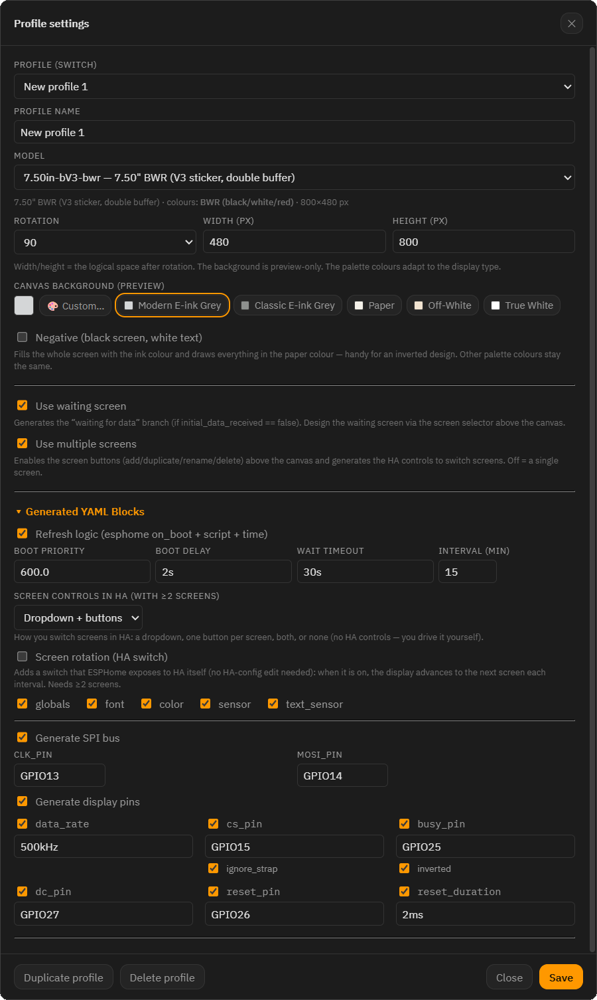
  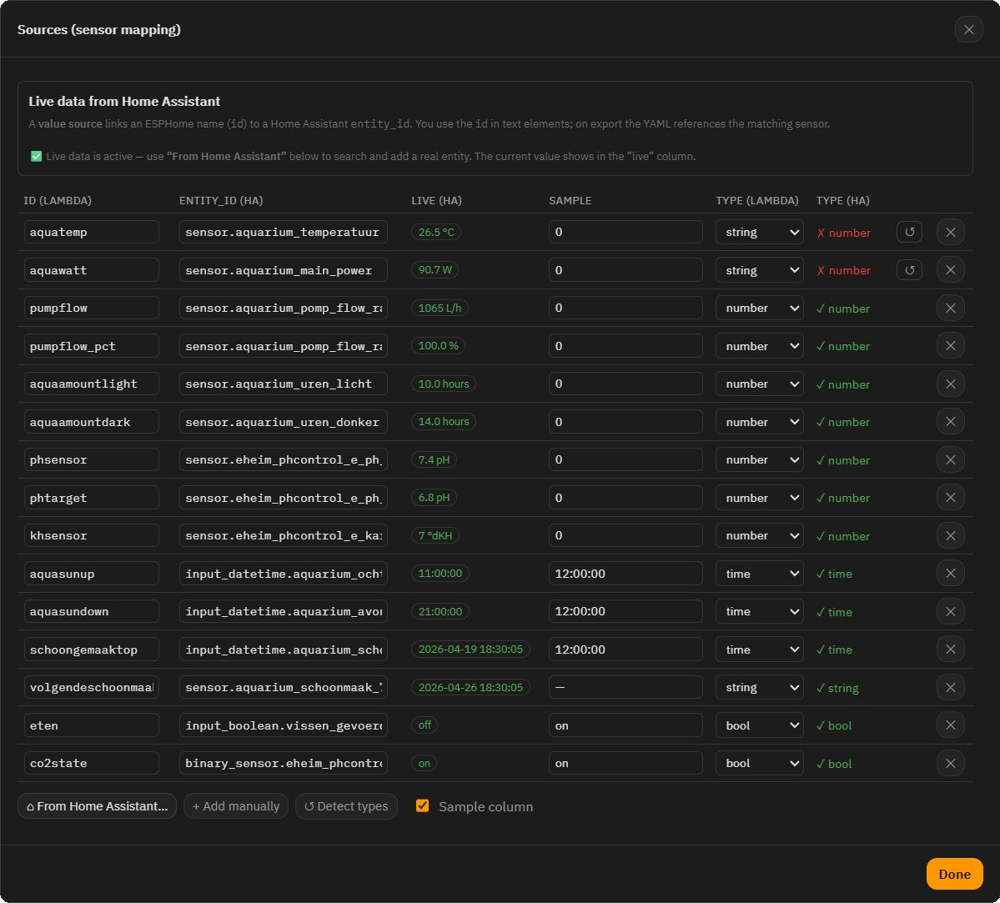
</p>

**Generate YAML** &nbsp;·&nbsp; **Import summary**

<p align="center">
  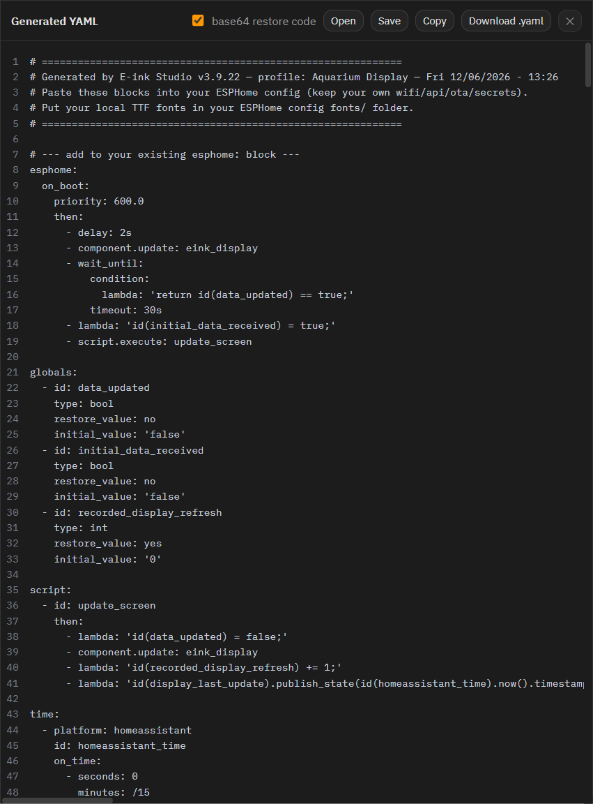
  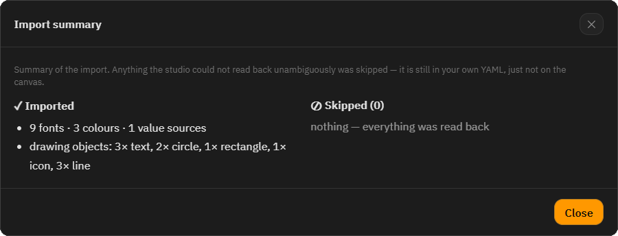
</p>

---

## 🚀 Installation

1. Add this repository to your Home Assistant add-on store:

   [](https://my.home-assistant.io/redirect/supervisor_add_addon_repository/?repository_url=https%3A%2F%2Fgithub.com%2FCl3tus%2FHA-Eink-Studio-App)

   *(Or manually: **Settings → Add-ons → Add-on Store → ⋮ → Repositories**, paste
   `https://github.com/Cl3tus/HA-Eink-Studio-App` and click **Add**.)*

2. Refresh the store, open **E-ink Studio**, click **Install** (the first build
   takes a few minutes), then **Start**.

3. Open **E-ink Studio** from the sidebar.

## ⚡ Quick start

1. Click **○ Live** to pull your real Home Assistant entities.
2. In **Bronnen / Sources → From Home Assistant**, add the sensors you want to show.
3. Drag a **Value** onto the canvas and bind it to a source (set format/transform).
4. Click **&lt;/&gt; Generate YAML**, then **Copy** or **Download** and paste it into
   your ESPHome device config.
5. Put your local TTF fonts in your ESPHome `fonts/` folder.

## ⚙️ Configuration

| Option | Values | Description |
|--------|--------|-------------|
| `language` | `auto` · `nl` · `en` | UI language. `auto` follows Home Assistant / browser. |
| `theme` | `auto` · `light` · `dark` | Colour theme. `auto` follows Home Assistant. |

Both can also be toggled on the fly inside the editor; the add-on option is the
default.

## 🗄️ Storage & SAMBA

Projects, fonts and profiles live in the add-on config folder, exposed over SAMBA at:

```
\\<HA-IP>\addon_configs\<slug>_eink_studio\
├── projects/   ← saved designs (.json)
├── fonts/      ← uploaded fonts (incl. the bundled MDI ttf)
└── profiles/   ← profile settings (.json)
```

Edit and back them up from your computer, or use the built-in **📁 File manager**.

## 🔄 Updating

Update notifications appear automatically in Home Assistant. Open the add-on and
click **Update**; the changelog is shown in the add-on UI.

## ⚠️ What it does *not* do

- It does **not** write to your ESPHome config or your fonts folder, and never
  writes to your HA states — the live data is preview-only by design. You copy the
  generated YAML into your device config yourself.

## 🤝 Contributing

Bug reports and ideas are welcome — open an
[issue](https://github.com/Cl3tus/HA-Eink-Studio-App/issues/new/choose) or read the
[contributing guide](CONTRIBUTING.md).

## 📝 License & credits

Released under the [MIT License](LICENSE).

Built with [Konva](https://konvajs.org/), [js-yaml](https://github.com/nodeca/js-yaml)
and [Material Design Icons](https://pictogrammers.com/library/mdi/), all bundled
locally for fully offline use. UI available in English and Dutch.

---

<p align="center">
  Proudly vibecoded by <b>Cletus</b> &amp; <a href="https://claude.com/claude-code">Claude Code</a> 🤖✨
</p>
