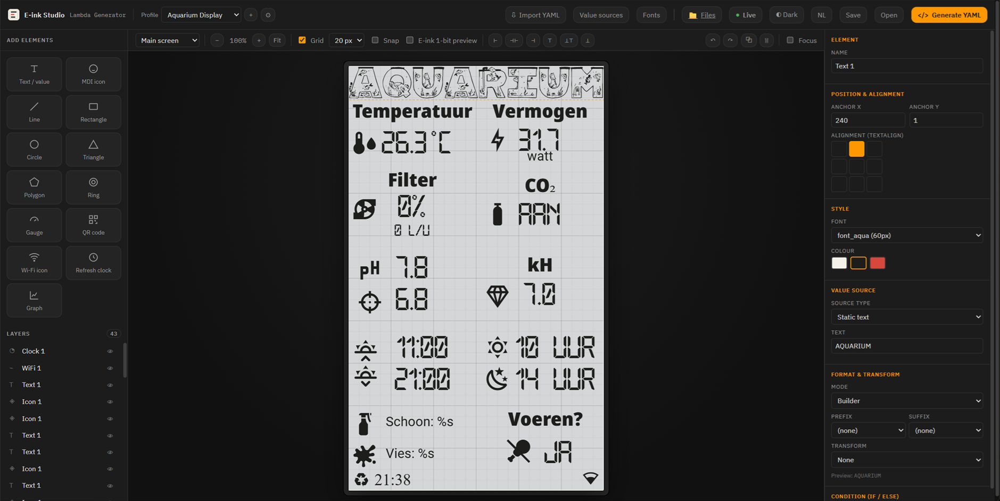
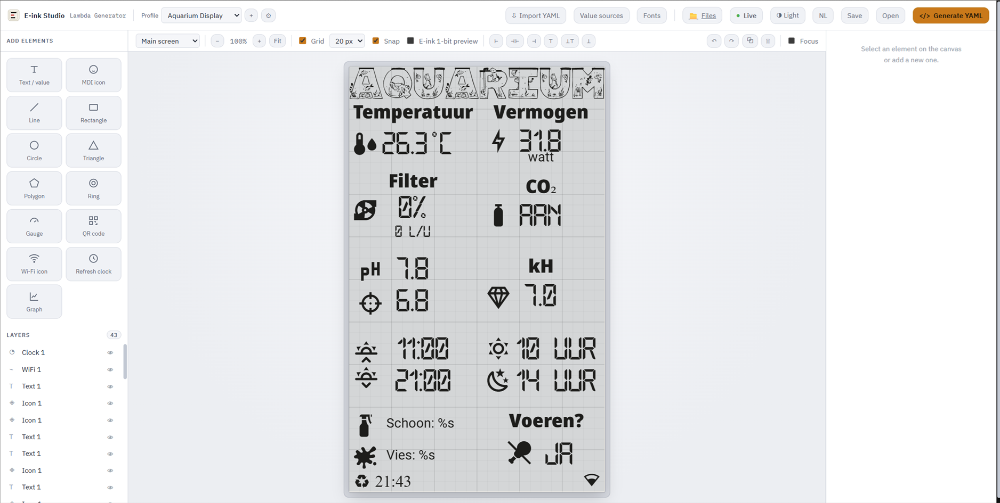
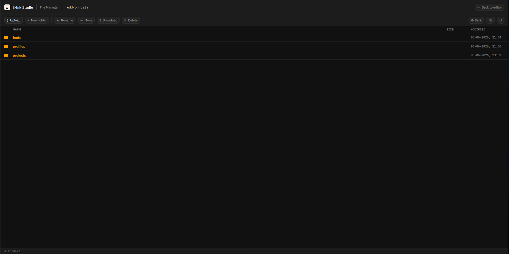
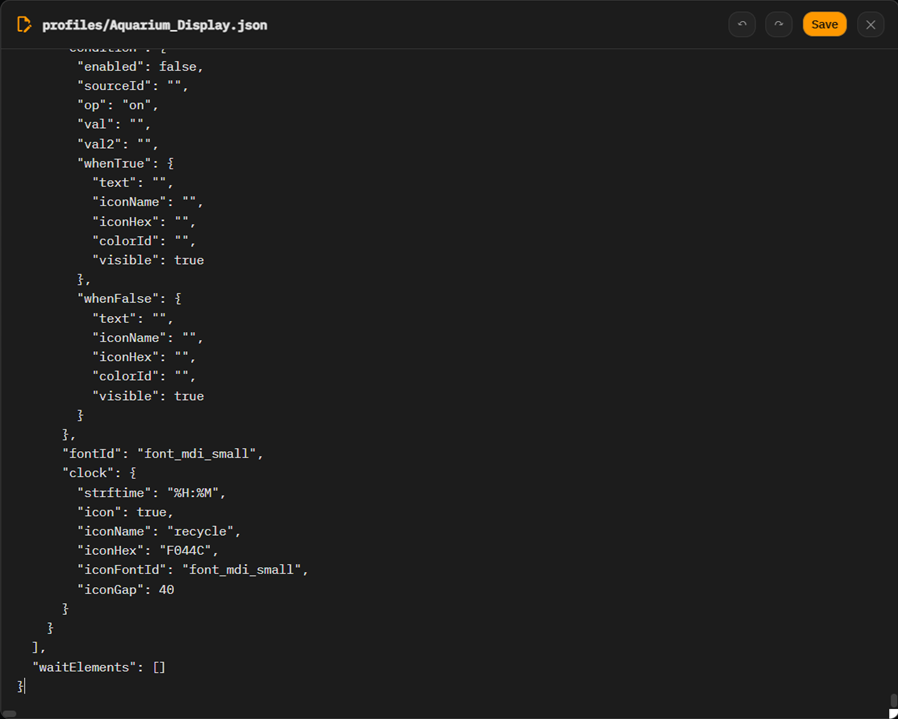

# E-ink Studio — Home Assistant Add-on

A **WYSIWYG editor for ESPHome e-ink displays**, running as a Home Assistant
add-on with its own sidebar panel (via Ingress). Design your display layout by
dragging elements onto a paper-accurate canvas, bind them to live Home Assistant
sensor values, and generate ready-to-paste ESPHome `display:` lambda + YAML.

[](https://my.home-assistant.io/redirect/supervisor_add_addon_repository/?repository_url=https%3A%2F%2Fgithub.com%2FCl3tus%2FHA-Eink-Studio-App)

---

## What it does

E-ink Studio turns the tedious job of hand-writing ESPHome `it.print()` /
`it.image()` lambdas into a visual design task:

- **Drag-and-drop canvas** — text, values, MDI icons, lines, rectangles,
  circles, Wi-Fi icons, refresh clocks, graphs and combined icon+value widgets.
- **Live Home Assistant data** — read-only preview of your real sensor states
  while designing (via the Supervisor API; nothing is written back to HA).
- **1-bit e-ink preview** — see exactly how your layout renders on a
  black/white (or tri-colour red) e-ink panel.
- **Fonts & colours** — manage GFonts / local fonts and the tri-colour palette.
- **Value sources & scenarios** — map entities to placeholders and preview
  different states.
- **YAML generator** — one click produces the ESPHome lambda + YAML to copy
  into your device config.
- **Built-in file manager** — browse, upload, download, rename, move and delete
  files and folders in the add-on storage, right from the sidebar.
- **Profiles** — keep multiple display designs side by side.
- **Light / dark theme** and **English / Dutch** — automatically following Home
  Assistant, or fixed via the add-on options.
- **Fully offline** — all libraries (Konva, js-yaml, MDI, fonts) are bundled; no
  internet connection required.

---

## Screenshots

**Editor — dark mode**


**Editor — light mode**


**Built-in file manager**


**File manager — text editor**


**File manager — font viewer**


---

## Installation

1. Click the button below to add this repository to your Home Assistant
   add-on store:

   [](https://my.home-assistant.io/redirect/supervisor_add_addon_repository/?repository_url=https%3A%2F%2Fgithub.com%2FCl3tus%2FHA-Eink-Studio-App)

   *(Or manually: **Settings → Add-ons → Add-on Store → ⋮ → Repositories**,
   then paste `https://github.com/Cl3tus/HA-Eink-Studio-App` and click **Add**.)*

2. Refresh the store; **E-ink Studio** appears at the bottom. Open it and click
   **Install** (the first build takes a few minutes while the image is built on
   your Home Assistant host).

3. Click **Start**, then open **E-ink Studio** from the sidebar.

---

## Configuration

The add-on has two options under its **Configuration** tab:

| Option | Values | Description |
|--------|--------|-------------|
| `language` | `auto` · `nl` · `en` | UI language. `auto` follows your Home Assistant / browser language. |
| `theme` | `auto` · `light` · `dark` | Colour theme. `auto` follows Home Assistant's light/dark setting. |

Both can also be toggled on the fly from inside the editor; the add-on option is
the default.

---

## Storage & SAMBA access

Projects, fonts and profiles are stored in the add-on config folder, which is
exposed over SAMBA at:

```
\\<HA-IP>\addon_configs\<slug>_eink_studio\
├── projects/   ← saved designs (.json)
├── fonts/      ← uploaded fonts
└── profiles/   ← profile settings (.json)
```

This lets you edit and back up your files directly from your computer. Inside
the editor, the built-in file manager (📁 **Files**) provides the same access.

---

## Updating

Bump notifications appear automatically in Home Assistant when a new version is
published. Open the add-on and click **Update**; the changelog is shown in the
add-on UI.

---

## What it does *not* do

- ❌ It does **not** write to your ESPHome configuration or fonts folder — the
  ESPHome live data is preview-only by design. You copy the generated YAML into
  your device config yourself.

---

## License & credits

UI/labels available in English and Dutch. Built with
[Konva](https://konvajs.org/), [js-yaml](https://github.com/nodeca/js-yaml) and
[Material Design Icons](https://pictogrammers.com/library/mdi/), all bundled
locally for fully offline use.
